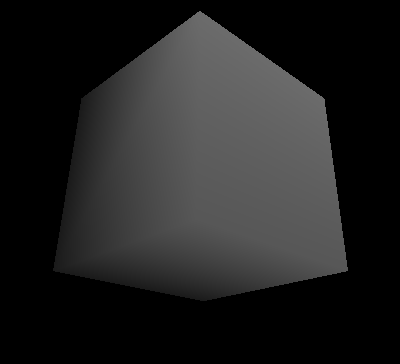
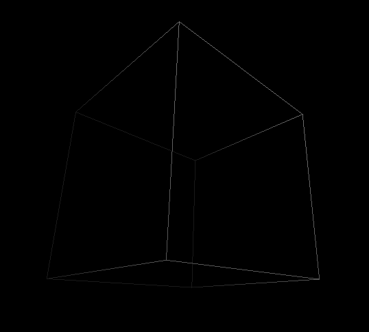
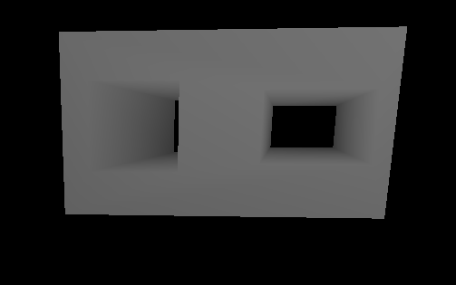
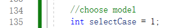
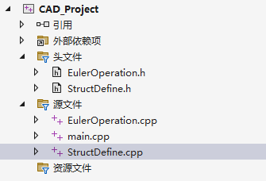

# CAD_PROJECT

## 任务

1）定义半边数据结构；

2）基于半边数据结构，实现五个基本欧拉操作；

3）基于欧拉操作，实现扫掠操作（必须允许二维区域带多个内环），并将基于扫掠操作构建的实体模型进行真实感图形显示。

## 实现

1）根据上课所学的知识以及老师讲的伪代码实现基于半边数据结构的欧拉操作和扫掠操作；

2）通过openGL库进行图形界面显示，将实体模型进行可视化并支持交互操作

## 结果展示

欧拉操作生成立方体

立方体线框模型

使用扫掠操作生成带两个通孔的模型

## 操作说明

在main.cpp中

选择生成的模型，0表示立方体，1表示两个通孔的模型，之后直接运行即可。

W A S D可以控制视角的移动，按住鼠标左键可以拖动视角，按Z可以切换线框模型。

## 项目结构

## 开发环境和配置

操作系统：Windows 11 x64 

集成开发环境：OpenGL 

编译器：VS 2022
